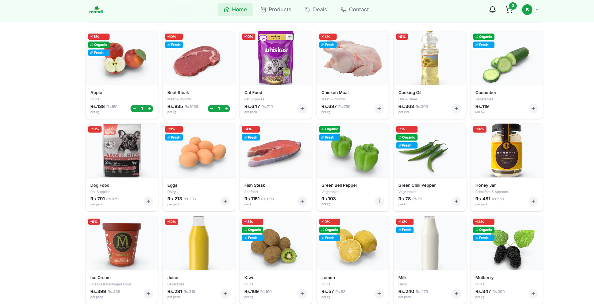
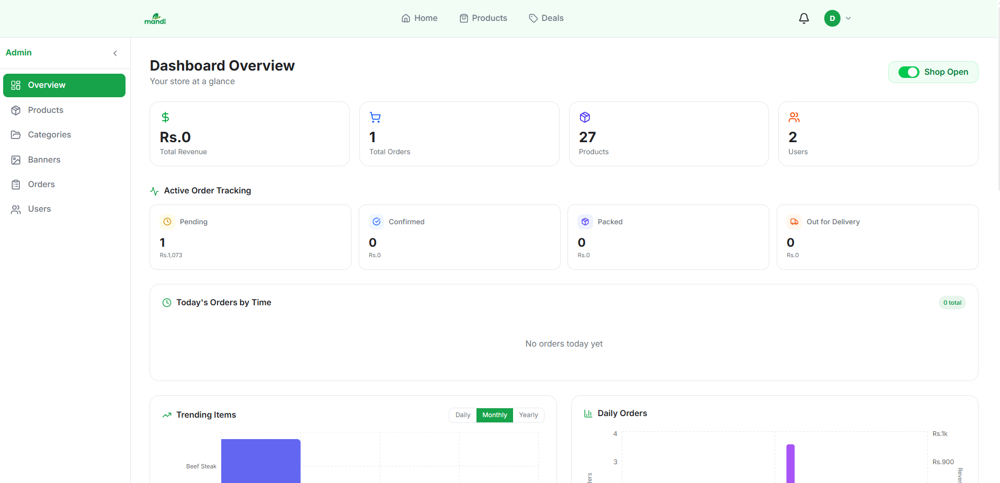
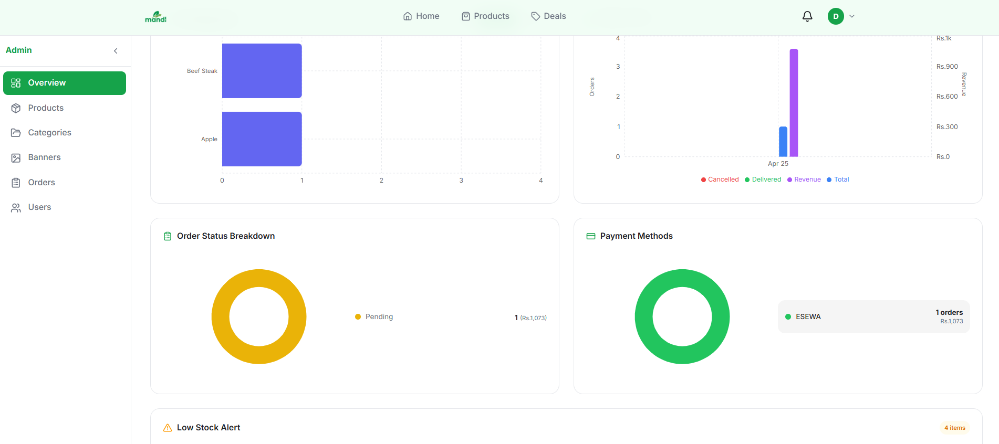

# 🛒 Mandi Grocery App

A full-stack e-commerce grocery delivery application built with modern web technologies. Mandi provides a seamless shopping experience for customers and comprehensive management tools for administrators.


 ### User login details

    - phone : 9899999999
    - password : test1234

 ### Admin login details

    - phone : 9768033768
    - password : adminadmin

# DEMO OF APP -[ Link here](https://mandi-three.vercel.app/)
# User view




# Admin dashboard



## 📋 Table of Contents

- [Features](#features)
- [Tech Stack](#tech-stack)
- [Prerequisites](#prerequisites)
- [Installation](#installation)
- [Configuration](#configuration)
- [Running the Application](#running-the-application)
- [Project Structure](#project-structure)
- [API Documentation](#api-documentation)
- [Features in Detail](#features-in-detail)
- [Contributing](#contributing)
- [License](#license)

## ✨ Features

### Customer Features

- 🔐 **Authentication & Authorization** - User signup, login, email verification, and password reset
- 🛍️ **Product Browsing** - Browse categories and view detailed product information
- 🛒 **Shopping Cart** - Add/remove items, manage quantities, and view cart summary
- 💳 **Checkout & Payment** - Secure payment integration with eSewa
- 📍 **Location Services** - Location picker for delivery address selection
- 📦 **Order Management** - Track orders, view order history, and order details
- 🔔 **Notifications** - Real-time notifications using Socket.io
- ⭐ **Special Deals** - Featured deals and promotions page
- 👤 **Profile Management** - Update user profile and settings
- 🌙 **Theme Support** - Light and dark theme options

### Admin Features

- 📊 **Dashboard** - Admin overview and analytics
- 📦 **Product Management** - Create, update, and delete products
- 🏷️ **Category Management** - Manage product categories
- 🎯 **Banner Management** - Create and manage promotional banners
- 📋 **Order Management** - View and manage customer orders
- 👥 **User Management** - Manage customer accounts
- ⚙️ **Settings** - Application-wide settings configuration

### Technical Features

- 🔄 **Real-time Updates** - Socket.io integration for live notifications
- 📧 **Email Notifications** - Automated email notifications for orders and password reset
- 📱 **SMS Support** - SMS notifications for important events
- 📸 **Image Management** - ImageKit integration for image optimization and storage
- 🗺️ **Mapping** - Leaflet maps for location selection
- 🎨 **Responsive Design** - Mobile-first responsive UI with Tailwind CSS
- 🔒 **Security** - JWT authentication, password hashing with bcrypt, helmet middleware
- ✅ **Input Validation** - Comprehensive validation with express-validator

## 🛠️ Tech Stack

### Backend

- **Runtime**: Node.js
- **Framework**: Express.js 5.2
- **Database**: MongoDB with Mongoose ODM
- **Authentication**: JWT (JSON Web Tokens)
- **Real-time**: Socket.io
- **Password Hashing**: bcrypt
- **File Upload**: Multer
- **Image Management**: ImageKit
- **Email Service**: Nodemailer with Mailgen
- **Validation**: express-validator
- **Security**: Helmet, CORS
- **Environment Management**: dotenv

### Frontend

- **Framework**: React 19 with Vite
- **Styling**: Tailwind CSS
- **Routing**: React Router DOM v7
- **HTTP Client**: Axios
- **Maps**: Leaflet & React-Leaflet
- **UI Components**: Lucide React (icons)
- **Charts**: Recharts
- **Notifications**: React Hot Toast
- **Real-time**: Socket.io Client
- **Linting**: ESLint

## 📦 Prerequisites

Before you begin, ensure you have the following installed:

- **Node.js** (v16 or higher) - [Download](https://nodejs.org/)
- **npm** or **yarn** - Comes with Node.js
- **MongoDB** - [Download](https://www.mongodb.com/try/download/community)
- **Git** - [Download](https://git-scm.com/)

### Required Accounts

- **ImageKit Account** - For image optimization and CDN ([Sign up](https://imagekit.io/))
- **eSewa Account** - For payment processing ([Sign up](https://esewa.com.np/))
- **Email Service** - For sending emails (Gmail, SendGrid, or any SMTP provider)
- **(Optional) Twilio Account** - For SMS notifications

## 📥 Installation

### 1. Clone the Repository

```bash
git clone <repository-url>
cd mandi
```

### 2. Install Backend Dependencies

```bash
cd backend
npm install
```

### 3. Install Frontend Dependencies

```bash
cd ../frontend
npm install
```

## ⚙️ Configuration

### Backend Environment Variables

Create a `.env` file in the `backend/` directory:

```env
# Server Configuration
PORT=5000
NODE_ENV=development

# Database
MONGODB_URI=mongodb://localhost:27017/mandi

# JWT Configuration
JWT_SECRET=your_jwt_secret_key_here
JWT_EXPIRE=7d
COOKIE_EXPIRE=7

# Email Configuration
EMAIL_HOST=smtp.gmail.com
EMAIL_PORT=465
EMAIL_USER=your_email@gmail.com
EMAIL_PASS=your_email_password_or_app_password
SENDER_EMAIL_NAME=Mandi Grocery

# ImageKit Configuration
IMAGEKIT_PUBLIC_KEY=your_imagekit_public_key
IMAGEKIT_PRIVATE_KEY=your_imagekit_private_key
IMAGEKIT_URL_ENDPOINT=https://ik.imagekit.io/your_account_id

# eSewa Configuration
ESEWA_MERCHANT_CODE=your_merchant_code
ESEWA_MERCHANT_SECRET=your_merchant_secret
ESEWA_SUCCESS_URL=http://localhost:3000/payment-success
ESEWA_FAILURE_URL=http://localhost:3000/payment-failure

# SMS Configuration (Optional)
TWILIO_ACCOUNT_SID=your_account_sid
TWILIO_AUTH_TOKEN=your_auth_token
TWILIO_PHONE_NUMBER=your_twilio_phone_number

# Frontend URL
FRONTEND_URL=http://localhost:5173

# Socket.io Configuration
SOCKET_ORIGIN=http://localhost:5173
```

### Frontend Environment Variables

Create a `.env` file in the `frontend/` directory:

```env
VITE_API_URL=http://localhost:5000/api
```

## 🚀 Running the Application

### Option 1: Run Both Servers Separately

**Terminal 1 - Backend:**

```bash
cd backend
npm run dev
```

The backend will start at `http://localhost:5000`

**Terminal 2 - Frontend:**

```bash
cd frontend
npm run dev
```

The frontend will start at `http://localhost:5173`

### Option 2: Seed Database (Optional)

To populate the database with sample data:

```bash
cd backend
npm run seed
```

### Production Build

**Build Frontend:**

```bash
cd frontend
npm run build
```

**Start Backend in Production:**

```bash
cd backend
npm start
```

## 📁 Project Structure

```
mandi/
├── backend/
│   ├── src/
│   │   ├── app.js                 # Express app configuration
│   │   ├── socket.js              # Socket.io setup
│   │   ├── controllers/           # Request handlers
│   │   │   ├── auth-controllers.js
│   │   │   ├── product-controllers.js
│   │   │   ├── order-controllers.js
│   │   │   ├── payment-controllers.js
│   │   │   ├── cart-controllers.js
│   │   │   └── ...
│   │   ├── models/               # MongoDB schemas
│   │   │   ├── user-models.js
│   │   │   ├── Product.js
│   │   │   ├── Order.js
│   │   │   ├── Cart.js
│   │   │   └── ...
│   │   ├── routes/               # API routes
│   │   │   ├── auth-routes.js
│   │   │   ├── product-routes.js
│   │   │   └── ...
│   │   ├── middlewares/          # Custom middlewares
│   │   │   ├── auth-middlewares.js
│   │   │   ├── validation-middlewares.js
│   │   │   └── upload-middlewares.js
│   │   ├── utils/                # Utility functions
│   │   │   ├── jwtToken-utils.js
│   │   │   ├── email-utils.js
│   │   │   ├── imagekit-utils.js
│   │   │   ├── esewa-utils.js
│   │   │   └── ...
│   │   ├── validators/           # Validation schemas
│   │   │   └── user-validation.js
│   │   └── db/
│   │       └── db.js             # Database connection
│   ├── server.js                 # Server entry point
│   ├── seed.js                   # Database seeding
│   └── package.json
│
├── frontend/
│   ├── src/
│   │   ├── main.jsx              # React entry point
│   │   ├── App.jsx               # Main App component
│   │   ├── api/                  # API client functions
│   │   │   ├── axios.js          # Axios instance
│   │   │   ├── authAPI.js
│   │   │   ├── productAPI.js
│   │   │   └── ...
│   │   ├── components/           # Reusable components
│   │   │   ├── layout/           # Layout components
│   │   │   └── ui/               # UI components
│   │   ├── context/              # React context providers
│   │   │   ├── AuthContext.jsx
│   │   │   ├── CartContext.jsx
│   │   │   ├── SocketContext.jsx
│   │   │   └── ThemeContext.jsx
│   │   ├── pages/                # Page components
│   │   │   ├── Admin/
│   │   │   ├── Auth/
│   │   │   ├── Home/
│   │   │   ├── Products/
│   │   │   ├── Cart/
│   │   │   ├── Checkout/
│   │   │   ├── Orders/
│   │   │   └── ...
│   │   ├── App.css               # Global styles
│   │   └── index.css
│   ├── vite.config.js
│   ├── tailwind.config.js
│   └── package.json
│
└── README.md
```

## 📡 API Documentation

### Authentication Endpoints

- `POST /api/auth/signup` - User registration
- `POST /api/auth/login` - User login
- `GET /api/auth/logout` - User logout
- `POST /api/auth/forgot-password` - Request password reset
- `POST /api/auth/reset-password` - Reset password with token
- `POST /api/auth/verify-email` - Verify email address
- `GET /api/auth/me` - Get current user profile

### Product Endpoints

- `GET /api/products` - Get all products
- `GET /api/products/:id` - Get product details
- `POST /api/products` - Create product (Admin)
- `PUT /api/products/:id` - Update product (Admin)
- `DELETE /api/products/:id` - Delete product (Admin)
- `GET /api/products/category/:id` - Get products by category

### Cart Endpoints

- `GET /api/cart` - Get user's cart
- `POST /api/cart` - Add item to cart
- `PUT /api/cart/:itemId` - Update cart item
- `DELETE /api/cart/:itemId` - Remove item from cart
- `DELETE /api/cart` - Clear cart

### Order Endpoints

- `POST /api/orders` - Create order
- `GET /api/orders` - Get user orders
- `GET /api/orders/:id` - Get order details
- `PUT /api/orders/:id` - Update order status (Admin)
- `DELETE /api/orders/:id` - Cancel order

### Category Endpoints

- `GET /api/categories` - Get all categories
- `POST /api/categories` - Create category (Admin)
- `PUT /api/categories/:id` - Update category (Admin)
- `DELETE /api/categories/:id` - Delete category (Admin)

### Banner Endpoints

- `GET /api/banners` - Get all banners
- `POST /api/banners` - Create banner (Admin)
- `PUT /api/banners/:id` - Update banner (Admin)
- `DELETE /api/banners/:id` - Delete banner (Admin)

### Payment Endpoints

- `POST /api/payment/initiate` - Initiate payment with eSewa
- `GET /api/payment/verify` - Verify payment status

For detailed API documentation, refer to the API collection or OpenAPI specification in your project.

## 🎯 Features in Detail

### Authentication Flow

1. User signs up with email and password
2. Email verification link sent to user's email
3. User verifies email to activate account
4. User can log in with credentials
5. JWT token issued and stored in cookies
6. Protected routes check token validity
7. Password reset via email link

### Shopping Experience

1. Browse products by category or search
2. View detailed product information and images
3. Add items to cart
4. Review cart and modify quantities
5. Proceed to checkout
6. Select delivery location
7. Choose payment method (eSewa)
8. Complete payment
9. Order confirmation via email
10. Track order status in real-time

### Admin Management

1. Dashboard with analytics and statistics
2. Product management (CRUD operations)
3. Category and banner management
4. Order status tracking and management
5. Customer communication via notifications
6. Settings and configuration management

## 🔐 Security Considerations

- **Password Security**: Passwords are hashed using bcrypt
- **JWT Tokens**: Secure token-based authentication
- **CORS**: Configured to allow requests from frontend only
- **Helmet**: Security headers middleware
- **Input Validation**: All inputs validated using express-validator
- **Environment Variables**: Sensitive data stored in .env files
- **SQL Injection Protection**: Using Mongoose ORM prevents NoSQL injection
- **XSS Protection**: React automatically escapes content

## 🚀 Deployment

### Backend (Render, Railway, or Heroku)

1. Push code to GitHub
2. Connect repository to deployment platform
3. Set environment variables
4. Deploy on platform

### Frontend (Vercel, Netlify, or Firebase)

1. Run `npm run build`
2. Deploy `dist` folder
3. Set `VITE_API_URL` to production API URL

## 📝 Contributing

Contributions are welcome! Please follow these steps:

1. Fork the repository
2. Create a feature branch (`git checkout -b feature/AmazingFeature`)
3. Commit your changes (`git commit -m 'Add some AmazingFeature'`)
4. Push to the branch (`git push origin feature/AmazingFeature`)
5. Open a Pull Request

## 📄 License

This project is licensed under the ISC License - see the LICENSE file for details.

## 📧 Support

For support, email gdhiraj030@gmail.com or open an issue on GitHub.

---

**Happy Coding! 🎉**
